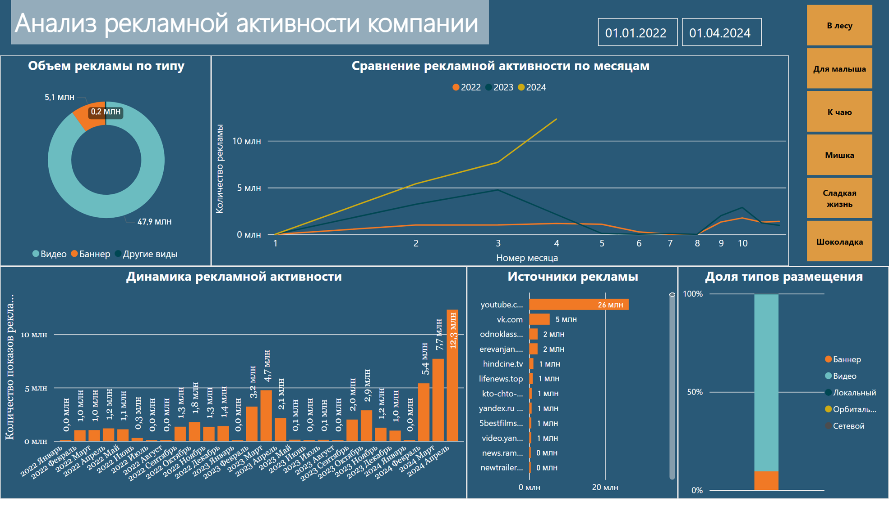

# Дашборды

## Power BI

### Анализ рекламной активности компании
Дашборд представляет собой анализ рекламной активности компании за период с января 2022 года по апрель 2024 года. Он включает в себя различные визуализации данных, такие как круговую диаграмму, отражающую информацию об объеме рекламы по типу, линейный график, где представлены данные о результатах рекламной активности выбранной компании, линейчатую диаграмму, отражающую сведения об источниках рекламы, а также две гистограммы. Первая из них показывает динамику изменения рекламной активности по месяцам, а вторая – доли типов размещения рекламы.

### Учет личных расходов
Дашборд представляет информацию о личных расходах на основании вымышленных данных. Он визуализирует сумму расходов по категориям, периодам и другим параметрам. В верхней правой части дашборда расположены карточки с общей суммой расходов за второе полугодие 2022 и 2023 гг., а также представлены данные, отражающие средний размер затрат в месяц. Реализована возможность выбора конкретного месяца для анализа информации за конкретные периоды. Ниже в левой части дашборда представлен кольцевой график, отражающий структуру ежемесячных трат по категориям, а также добавлена ленточная диаграмма, показывающая изменение трат со временем в абсолютном выражении. В правой части дашборда расположены диаграммы, указывающие на изменение трат в процентах по категориям, на размеры трат по торговым сетям, а также на динамику увеличения и уменьшения расходов по торговым сетям.

## DataLens

### Анализ выигрышей в рекламной игре
Дашборд отражает сведения о выигрышах в рекламной игре «Удача в придачу». В верхнем левом углу расположено два индикатора, отражающих основную цифровую информацию. Рядом расположен график, представляющий динамику изменения количества выигрышных кодов в зависимости от тура рекламной игры. В верхнем правом углу расположено четыре селектора, позволяющих детализировать имеющуюся информацию по следующим критериям: номеру тура, региону победителя, наименованию выигрыша и/или полу победителя. Также на дашборде присутствует тепловая карта, которая отражает географическое распределение данных о победах в игре. В нижней части дашборда отражены сведения о типах и количестве разыгранных призов.

#### [Кликабельный дашборд](https://datalens.yandex/u0sl1z7wp4qsi)

### Эффективность рекламной кампании
Данный дашборд помогает оценить эффективность рекламной кампании. В верхней части дашборда расположены четыре основных селектора, позволяющих фильтровать данные по периоду ее проведения, возрасту и полу аудитории, а также типу устройства. Ниже расположены два графика: слева – линейный график, отражающий динамику трафика, справа – столбчатая диаграмма, показывающая данные по динамике конверсий. Внизу дашборда расположена таблица с детализированными данными, отражающими эффективность проводимых рекламных мероприятий.

#### [Кликабельный дашборд](https://datalens.yandex/d06cfidugspo0)

